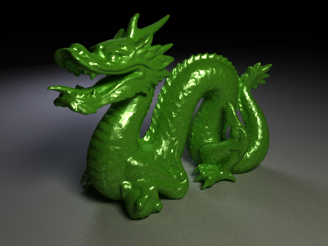
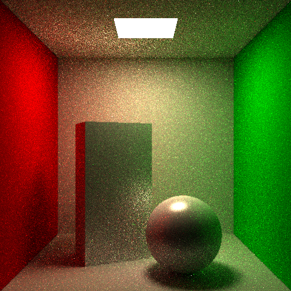
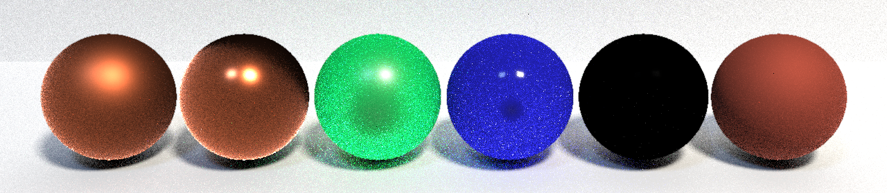

# CPU PathTracer

This project explored and implemented the nuts and bolts of path tracing on the CPU, beginning with a simple recursive Whitted style raytracer, then progressing to a path tracer with next-event estimation and russian roulette.
I completed this project in my spare time alongside my AI and ML MPhil/PhD studies due to my passion for computer graphics and goal of implementing novel AI techniques for accelerating, complementing and supporting state-of-the-art path tracing.
Even though I already have created a fairly advanced hardware raytracer with DirectX 12 and DirectX Raytracing, I felt it was essential to build a strong foundation in the core principles of light transport, sampling theory and variance reduction, hence I chose to build a CPU path tracer from scratch without any assistance of graphics APIs.

## Visual Results

 Figure 1: 64 SPP Stanford Chinese Dragon rendered with NEE and RR

 

 Figure 2: 64 SPP Cornell Box rendered with NEE and RR

 Figure 3: 64 SPP variety of spheres rendered using the GGX BRDF

## Next Steps

1) Multiple Importance Sampling
2) Caustics
3) OBJ/GLTF model loading
